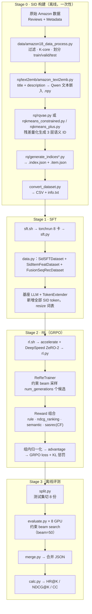
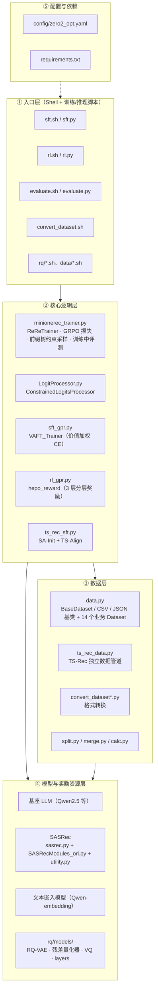
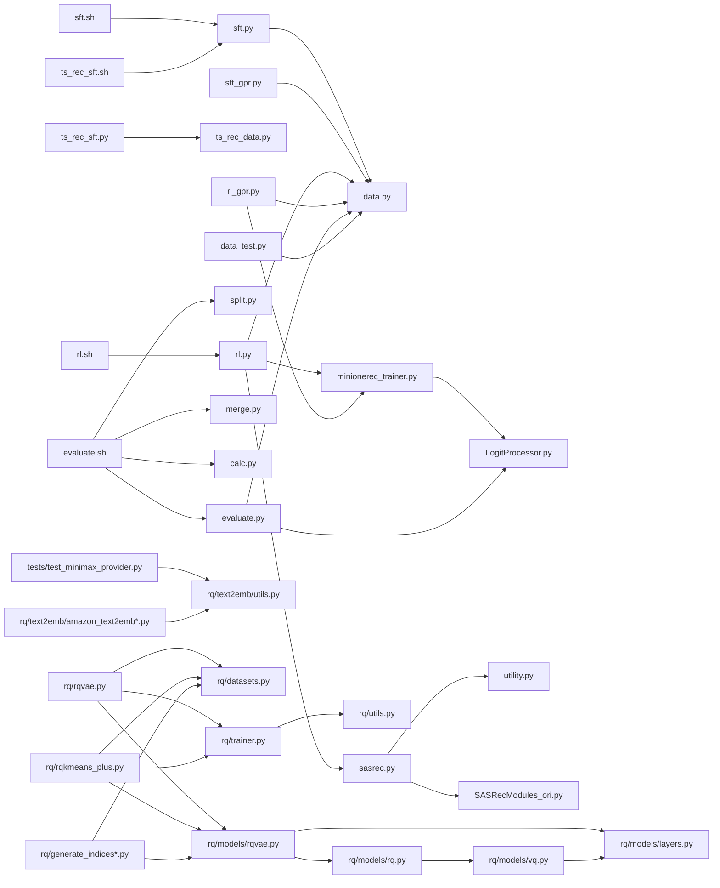
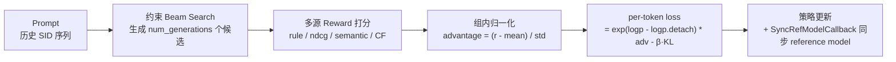
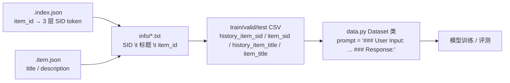

# MiniOneRec 项目结构分析

> 分析对象：`d:/ctrpred/minionerec/MiniOneRec`
> 定位：首个全开源**生成式推荐（Generative Recommendation）**框架，端到端覆盖 **SID 构建 → 监督微调 SFT → 推荐导向强化学习 RL → 离线评测**。
> 论文：MiniOneRec (arXiv:2510.24431)；GPR / HEPO；TS-Rec (arXiv:2602.22632)

---

## 1. 整体目录结构

```
MiniOneRec/
├── assets/                     # README 图片资源（logo、框架图、结果图）
├── config/
│   └── zero2_opt.yaml          # DeepSpeed ZeRO-2 + bf16 分布式配置（供 rl.sh 用）
├── data/                       # 数据预处理 + 已处理好的 Amazon 数据
│   ├── amazon18_data_process.py / .sh      # Amazon18 过滤、K-core、划分 train/valid/test
│   ├── amazon18_data_process_gpr.py        # GPR 版：额外抽取用户/物品异构特征
│   ├── amazon23_data_process.py / .sh      # Amazon23 预处理
│   ├── process.py                          # 早期版预处理
│   └── Amazon/                             # 已预处理数据集（Industrial_and_Scientific / Office_Products）
│       ├── index/   # .index.json（item_id→SID）、.item.json（title/description）、.emb-*.npy（文本嵌入）
│       ├── info/    # SID\t标题\titem_id
│       └── train/ valid/ test/             # 交互 CSV
├── rq/                         # SID 构建（残差量化）模块
│   ├── datasets.py / trainer.py / utils.py # EmbDataset、RQ-VAE Trainer、通用工具
│   ├── rqvae.py / .sh                      # RQ-VAE 训练
│   ├── rqkmeans_faiss.py                   # RQ-Kmeans（FAISS 版）
│   ├── rqkmeans_constrained.py / .sh       # 约束 RQ-Kmeans（均衡聚类 + 去重）
│   ├── rqkmeans_plus.py / .sh              # RQ-Kmeans+（残差连接 + 热启动）
│   ├── generate_indices.py                 # RQ-VAE → .index.json
│   ├── generate_indices_plus.py / .sh      # RQ-Kmeans+ → .index.json
│   ├── models/                             # rqvae.py / rq.py / vq.py / layers.py
│   └── text2emb/                           # 文本 → 向量
│       ├── amazon_text2emb.py / .sh (+ _gpr 版)  # accelerate 多卡并发生成嵌入
│       └── utils.py                        # LLM API 工具（openai / deepseek / minimax）+ 文本清洗
├── tests/
│   └── test_minimax_provider.py            # MiniMax LLM provider 测试
├── ts_rec_data/
│   └── Industrial_and_Scientific.description_keywords.json   # SID token → 语义描述 + 关键词（TS-Rec 用）
├── data.py                     # ★ 统一数据管道（20 个 Dataset 类，SFT / RL / Eval 三条线）
├── data_test.py                # data.py 单元测试
├── sft.py / sft.sh             # Stage 1：SFT 训练
├── sft_gpr.py                  # GPR 变体：VAFT 价值加权 SFT
├── rl.py / rl.sh               # Stage 2：GRPO 强化学习训练
├── rl_gpr.py                   # GPR 变体：HEPO 分层奖励 RL
├── minionerec_trainer.py       # ★ 核心：ReReTrainer（GRPO 定制 Trainer + 约束解码）
├── LogitProcessor.py           # 约束解码 LogitsProcessor
├── evaluate.py / evaluate.sh   # Stage 3：离线 Top-K 评测
├── split.py / merge.py / calc.py            # 评测三件套：切分 / 合并 / 指标计算
├── sasrec.py / SASRecModules_ori.py / utility.py   # SASRec 协同过滤基线（RL 的 CF reward 来源）
├── ts_rec_data.py / ts_rec_sft.py / ts_rec_sft.sh  # TS-Rec 分支（SA-Init + TS-Align）
├── convert_dataset.py / convert_dataset_gpr.py / .sh  # RQ 数据集 → 训练 CSV
├── requirements.txt / README.md / LICENSE
```

---

## 2. 端到端流水线



---

## 3. 分层架构



---

## 4. 模块依赖关系



---

## 5. 三个实现变体对比

| 维度 | Baseline | GPR 变体（异构/价值感知） | TS-Rec 变体（细粒度语义） |
| --- | --- | --- | --- |
| 数据预处理 | `amazon18_data_process.py` | `amazon18_data_process_gpr.py` | 同 baseline |
| 数据集转换 | `convert_dataset.py` | `convert_dataset_gpr.py`（+U/E/I/O token 列） | `convert_dataset.py` |
| 数据管道 | `data.py` | `data.py`（`SidSFTDataset_GPR`） | `ts_rec_data.py`（独立） |
| SFT 脚本 | `sft.py` | `sft_gpr.py`（**VAFT**：`log1p(value)` 加权 CE） | `ts_rec_sft.py`（**SA-Init** 用 keywords 词向量初始化 SID embedding + **TS-Align** token↔描述对齐） |
| RL 脚本 | `rl.py` | `rl_gpr.py`（**HEPO**：3 层 SID 分层奖励 0.2/0.5/1.0） | — |
| 视觉/嵌入 | Qwen 文本嵌入 | Qwen 文本嵌入 + LLM 生成结构化特征 | 增加 token↔description+keywords 对齐 |

---

## 6. 核心机制说明

### 6.1 约束解码（保证生成的 SID 一定合法）
- `minionerec_trainer.py.__init__` 从 `info` 文件构建 **SID 前缀树 `hash_dict`**；
- 生成时 `ConstrainedLogitsProcessor` 把非法 token 的 logits 置 `-inf`，只允许前缀树中的合法下一个 token；
- 若整步无合法 token，则强制输出 EOS 终止非法序列（对应评测中的 **CC 指标**）。

### 6.2 GRPO 训练（`ReReTrainer.compute_loss`）

- 支持三种损失模式：**DAPO**（全 token 平均）、**GSPO**（序列级比值）、标准 GRPO；
- `--reward_type` 可选：`rule` / `ranking` / `ranking_only` / `semantic` / `sasrec`。

### 6.3 评测指标
- `calc.py` 统计 **HR@{1,3,5,10,20,50}**、**NDCG@{...}**（beam 内首次命中位次决定 NDCG）；
- 额外统计 **CC**（无效物品生成数），README 强调 CC ≠ 0 说明约束解码失效，需检查 transformers 版本（可用 base 模型规避）。

---

## 7. 数据流与文件格式



| 文件 | 格式示例 |
| --- | --- |
| `.index.json` | `{"0": ["<a_236>", "<b_231>", "<c_226>"], ...}` |
| info `.txt` | `<a_236><b_231><c_226>\t商品标题\titem_id` |
| 训练 CSV | `user_id, history_item_title, item_title, history_item_id, item_id, history_item_sid, item_sid`（history 列为 Python list 字符串） |
| keywords JSON | `[{"description": "...", "keywords": [...], "token": "<a_236>"}, ...]` |

---

## 8. 关键文件职责速查

| 文件 | 职责 |
| --- | --- |
| `sft.py` | SFT 主脚本：加载基座 → `TokenExtender` 扩充 SID 词表（可 `--freeze_LLM` 只训新 token）→ 三数据集拼接 → HF Trainer |
| `sft_gpr.py` | 同上 + 9 个异构特殊 token + `VAFT_Trainer`（价值加权损失） |
| `rl.py` | RL 主脚本：SFT 模型 → 5 种 reward → `GRPOConfig` → `ReReTrainer` |
| `rl_gpr.py` | 同上 + `hepo_reward` 分层奖励 |
| `minionerec_trainer.py` | 全项目核心（61KB）：`ReReTrainer`、前缀树约束采样、训练中评测、GRPO 损失、ref model 同步 |
| `data.py` | 20 个 Dataset 类：SFT 线（`SidSFTDataset` / `SidItemFeatDataset` / `FusionSeqRecDataset` / `PreferenceSFTDataset`…）、RL 线（`SidDataset` / `RLTitle2SidDataset` / `RLSeqTitle2SidDataset`…）、Eval 线（`EvalSidDataset` / `EvalD3Dataset`） |
| `evaluate.py` | 离线评测：双前缀树（语义 SID + 标题）约束 beam=50 生成，写出预测 JSON |
| `LogitProcessor.py` | 约束解码核心，被 trainer 与 evaluate 共用 |
| `sasrec.py` | 序列推荐基线，产出 checkpoint 供 RL 的 `cf_reward` 打分 |
| `ts_rec_sft.py` | TS-Rec：SA-Init（语义感知初始化）+ TS-Align（token↔描述对齐） |
| `calc.py` | HR / NDCG / CC 指标计算 |

---

## 9. 技术栈

| 类别 | 主要依赖 |
| --- | --- |
| 训练框架 | torch 2.6.0、transformers 4.57.1、trl 0.24.0、deepspeed 0.18.0、accelerate 1.10.1、bitsandbytes 0.48.1 |
| 数据/工具 | datasets 4.2.0、pandas 2.2.2、numpy 1.26.3、pyarrow、polars（RQ-Kmeans 系列手动装） |
| 推荐相关 | torchrec 0.6.0+cu118、torchsnapshot、torcheval、torchmetrics |
| 其他 | wandb、fire、PyYAML、openai（LLM API）、faiss-gpu / k-means-constrained（手动装） |

---

## 10. 注意事项（代码中的不一致点）

1. **`ts_rec_sft.sh` 调用的是 `sft.py`，但传了只有 `ts_rec_sft.py` 才支持的 `--description_path`**，且引用的 `./data/Amazon/*.description_keywords_rqvae.json` 在仓库中不存在（实际文件在 `ts_rec_data/` 下），需修正后才能启用 SA-Init。
2. README 中写的是 `configs/`，实际目录名为 `config/`；README 未列出自带数据 `data/Amazon/` 与 `ts_rec_data/`。
3. `generate_indices.py` 存在两份副本（`rq/` 与 `rq/models/`），README 指向的是 `rq/generate_indices.py`。
4. `data.py` 统计上提到 20 个 Dataset 类，其中部分（`SFTData`、`TitleHistory2SidSFTDataset` 等）在训练脚本中被注释备用。
